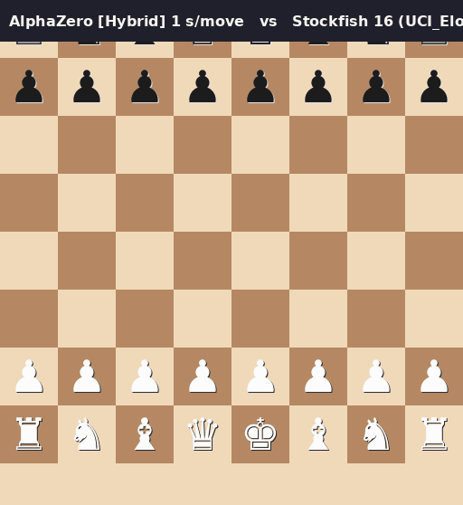

# AlphaZero Chess — self-play from scratch

[](LICENSE)


> Train an AlphaZero-style chess engine **from zero** (Monte-Carlo Tree Search
> + neural network, pure self-play) and play it in any UCI GUI — this repo
> ships a working **PyChess** integration and honest, measured results.

**English** | [Español](README.es.md)



*Real game recorded by `play_match.py`: AlphaZero (Hybrid, 1 s/move) vs
Stockfish 16 at `UCI_Elo 1350` — checkmate in 65 moves, no editing.*

## TL;DR

```bash
pip install -r requirements.txt
python main.py --iterations 10 --self-play-games 40   # train (CPU-friendly)
python search.py --bench                             # alpha-beta bench: depth 7 / 2 s
python play_match.py --games 4 --elo 1350            # match vs Stockfish
```

Then point any UCI GUI at `alpha_zero_engine.py` and play.

## What's inside

- **`self_play.py` / `mcts.py` / `neural_network.py`** — the AlphaZero loop:
  MCTS guided by a policy+value ResNet, self-play games, replay buffer,
  arena evaluation, checkpointing. No external AlphaZero code.
- **`search.py`** — the twist: a classical **alpha-beta searcher** (negamax,
  quiescence, transposition table, tapered PeSTO eval, iterative deepening,
  killers/history/LMR/futility) that takes the network's priors as root
  probabilities. This *hybrid* is much stronger than the raw MCTS with the
  current (small) training budget.
- **`alpha_zero_engine.py`** — a real **UCI engine** with two selectable
  search modes, time management, `stop`, `info`/`pv` output and a background
  search thread. Option `SearchType = Hybrid | MCTS`.
- **`play_match.py`** — UCI-vs-UCI match runner (Elo gates or full strength).
- **`verify_pychess_integration.py`** — headless test using the *real*
  PyChess code: discovery, option handshake and a move from both entries.

## Measured results

Everything below was produced by `play_match.py` (1 s/move for us,
200 ms/move for Stockfish unless noted). No cherry-picking — the failures
stay in the table.

| Stockfish 16 opponent | Before (v1.0) | Now (v1.5) |
|---|---|---|
| `UCI_Elo 1350` | 0W – 0D – 4L | **6W – 0D – 0L** |
| `UCI_Elo 1600` | — | **3W – 1D – 0L** (+2/4) |
| `UCI_Elo 1800` | — | 0W – 1D – 3L (−3/4) |
| Full strength (0.5 s) | — | 0W – 0D – 1L (expected) |

Alpha-beta bench: **depth 7 in 2 s (~29 kNPS)**, **6/6** tactics puzzles.

Estimated playing strength: **≈1650–1750 Elo**. At full strength Stockfish 16
is still far stronger — an honest limitation, not a hidden one: this is a
Python engine with a network trained on a laptop CPU.

## Install

```bash
python3 -m venv .venv
source .venv/bin/activate
pip install -r requirements.txt      # torch, python-chess, numpy, tensorboard
```

Optional, for the GUI/tests: a system PyChess (`apt install pychess`) and
Stockfish (`apt install stockfish`). Neither is bundled — both are GPL
programs you install yourself.

## Train

```bash
python main.py --iterations 20 --self-play-games 40 --mcts-sims 100
tensorboard --logdir logs
```

`config.py` holds the paper-scale defaults (100 iterations × 10 000 games);
start small on CPU. Checkpoints land in `models/` (weights are **not**
committed — see `.gitignore`).

## Play it

**Any UCI GUI** (Arena, CuteChess, PyChess…) → add a new engine →
command:

```bash
python /path/to/alpha_zero_engine.py
```

> The committed shebang points at the original author's venv; edit the first
> line of `alpha_zero_engine.py` or launch it through your own `python`.

Useful UCI options: `SearchType` (Hybrid|MCTS), `UseNN`, `MCTS_Simulations`,
`Hash`.

**PyChess** registers it in `~/.config/pychess/engines.json`:

```json
{
  "name": "AlphaZeroChess",
  "command": "/path/to/alpha_zero_engine.py",
  "protocol": "uci",
  "level": 20,
  "analyze": true,
  "recheck": true
}
```

This repo ships **two** entries so you can pick the mode right in the
New Game dialog: `AlphaZeroChess` (Hybrid) and `AlphaZeroChess-MCTS`
(MCTS puro). Options are editable under *Tools → Engines*; a saved
`value` is applied at engine start. Re-run
`python verify_pychess_integration.py` after touching the engine binary —
a checksum change makes PyChess re-discover and drop saved option values.

**Command line:**

```bash
python play_match.py --games 4 --elo 1600 --engine Hybrid
python play_match.py --games 1 --full-strength --sf-time-ms 500
python search.py --bench
```

## Repository layout

| Path | What it is |
|---|---|
| `main.py` / `coach.py` | training loop (self-play → buffer → train → arena) |
| `chess_env.py` / `neural_network.py` | environment wrapper + ResNet (policy & value) |
| `mcts.py` / `self_play.py` | MCTS with NN priors + self-play generation |
| `search.py` | hybrid alpha-beta searcher (the strong one) |
| `alpha_zero_engine.py` | UCI engine front-end (Hybrid / MCTS) |
| `play_match.py` | UCI match runner with Elo gating |
| `verify_pychess_integration.py` | headless PyChess integration test |
| `CHANGELOG.md` | version history 1.0 → 1.5 with every fix, in Spanish |

## Known limitations / roadmap

- The value head is still weak; the shipped checkpoint comes from **a single
  self-play iteration** (10 games, 100 MCTS sims, ~53 min on CPU). More
  training directly improves MCTS.
- Full-strength Stockfish wins — comfortably. The gap is honest and measured.
- Python throughput: ~29 kNPS alpha-beta, ~115 sims/s MCTS. Porting the hot
  paths to a compiled extension is the obvious next step.

## License

[MIT](LICENSE). Stockfish and PyChess are separate GPL programs and are not
redistributed here.
